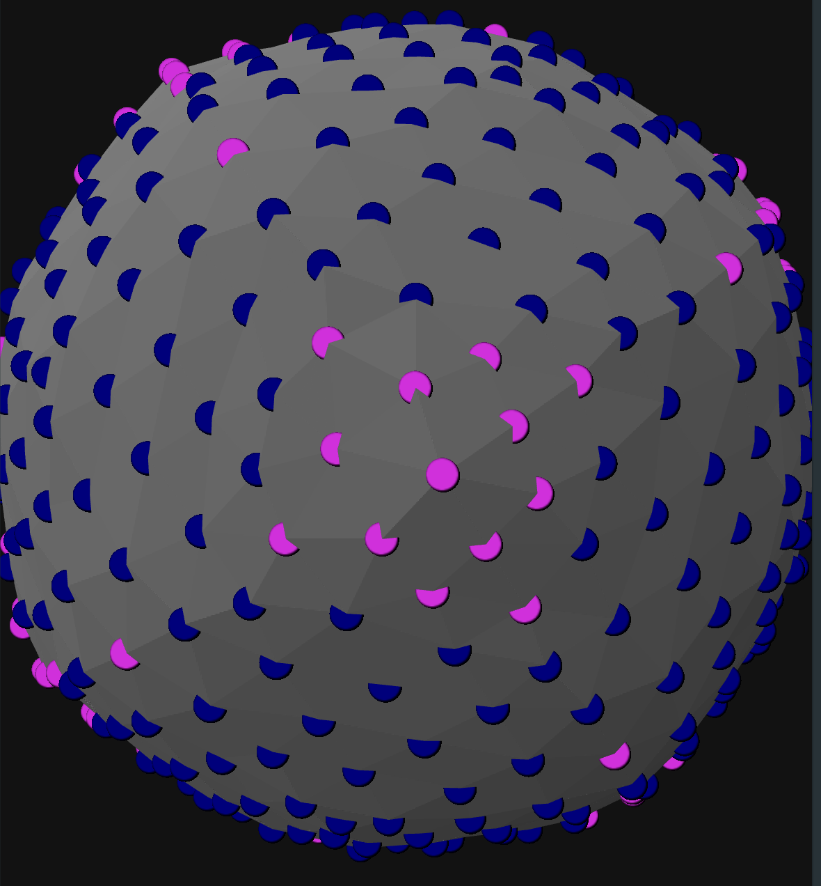

# Список задач для модуля plytoplane

- Реализовать трехкратный обход с целью получить одинаковые паттерны для любой стартовой точки
- Реализовать алгоритмы сравнения поверхностей (При необходимости, если никак иначе не получится валидировать построение)
- Реализовать алгоритмы поворотов поверхностей (Если потребуется)

## *Трехкратный обход. Принципы*
$$ 
P_s = \{ p_i \mid p_i - \text{точки поверхности трехмерного тела} \}
$$

$$
\forall p_i \in P_s: p_i = \{ x_i, y_i, z_i \}
$$

$$
\text{Существует так же объект} \; P_p = \{ p_j \mid p_j - \text{ точки проекции } P_s \text{ на плоскость } \}
$$

Из такой постановки задачи видны следующие требования к алгоритму

Между $P_s$ и $P_p$ существует взаимно однозначное соответствие. Следовательно отображение $P_s \rightarrow P_p$ биективно и значит существует обратное отображение $P_p \rightarrow P_s$. Это означает, что по полученной проекции на плоскость мы можем точно восстановить трехмерную структуру белка, спроецированного на плоскость

Это требование взаимной однозначности может выполняться в момент построения благодаря индексации массивов. Следовательно $i = j \implies p_j$ есть плоскостная проекция $p_i$ и $p_i$ есть пространственная точка для $p_j$ 

Основной задачей данного подхода является построение плоскостной карты при трехкратном обходе поверхности. При этом каждый обход должен выполняться так, словно он выполняется однократно, а новый обход должен запускаться только после выполнения предыдущего. Такая задача влечет необходимость разметки пройденных точек, таким образом что бы мы могли точно знать: 

- Какой по счету обход выполняется в данный момент?
- Текущий обход завершен, или еще выполняется?
- Точка и все ее соседи пройдены в рамках текущего обхода? 

Ответом на эти вопросы может быть следующее.

$\forall P_s, \forall P_p \; \exists i_{max} : \forall i : i \le i_{max}$

Следовательно, можно ввести величину $L = |P_s| = |P_p|$, переменную $D$ (detour, англ) и счетчик $c$ связанные отношением $D = \lceil \frac{c}{L} \rceil$. И данное отношение однозначно даст нам ответ на первый вопрос. Из этих же переменных мы всегда можем получить текущую позицию в конкретном обходе как $c = i_l \mod{L}$. Это же отношение дает ответ на второй вопрос, так как D есть номер текущего обхода и если на следующем шаге он отличается от того, что была на текущем, значит в этот момент текущий обход завершается.

Теперь попробуем ответить на вопрос о том, была ли пройдена конкретная точка в рамках текущего обхода? Этот вопрос важен, посколько обходы должны выполняться обязательно последовательно. Ни одна из точек будущих обходов не должна включаться в разметку карты на текущем и наоборот. Такое включение приведет к нарушених соотношений на плоскостной проекции и полной неразберихе в данных. Следовательно этот момент чрезвычайно важно выполнить правильно

Введем дополнительную переменную для каждой точки таким образом, что теперь точки представляют собой следующие структуры

$$
\forall p_i \in P_s: p_i = \{ x_i, y_i, z_i, d_{ic} \} - d_{ic} \; \text{есть индекс обхода в котором эта точка уже была пройдена} 
$$
Тогда ответом на вопрос, была ли пройдена точка в рамках текущего обхода станет условие
$D < d_{ic}$ Так же этим условием мы получаем пространство для тестирования. Условие $D > D_{ic}$ никогда не должно выполняться. 

### Описание структур данных

Поскольку точка в пространстве и точка на плоскости в рамках задачи должны иметь взаимно однозначное соответствие, определяемое индексацией, имеет смысл ввести следующую структуру данных

```C++

typedef struct {
    double x; double y; double z;
} Point3D;

typedef struct {
    double x; double y;
} Point2D;

typedef struct {
    Point3D ps; // Точка в пространстве
    Point2D pp; // Точка на плоскостной проекции
    unsigned int d_ic; // Индекс обхода в котором эта точка уже была пройдена
} AbstractPoint;
```

# Тестирование  алгоритмов обхода
Для тестирования было принято решение продолжать использование языка C++ так как все современные методы "быстрых" решений на основе скриптовых языков не обладают нужной степенью добротности. Скриптовые языки не учитывают множество факторов, в результате чего кажущаяся экономия времени оборачивается его растраниванием. Компилируемые языки, такие как С и С++ не предоставляют инструментов думающих за разработчика, по этому разработчику приходится самому писать такие инструменты и сразу продумывать все важные для конкретной ситуации моменты, что является намного более эффективным подходом, хотя и требует больших умственных усилий для достижения поставленной цели. В дальнейшем приоритетным языком считается С и С++.

Для достоверного тестирования алгоритмов обхода требуется трехмерная вихуализация получаемых данных. Такая визуализация может быть выполнена с написанием собственного графического движка на основе OpenGL. Так как эта работа является достаточно трудоемкой по времени, на текущем этапе планируется пользоваться уже существующими инструментами визуализации трезмерных данных. Open3D, blender, gnuplot. После получения практически значимых результатов от нейронной сети, будет написан движок визуализации данных.

Цели тестирования: 

1. Создание простой модели данных
2. Визуализация модели
3. Визуализация стартовых точек
4. Визуализация пути прохождения по трехмерной модели
5. Отображение плоскостной проекции пути прохождения

Учитывая неоходимость быстрой работы алгоритма а так же учитывая доступность данным по структурам данных по языку C++ с целью достижения большей производительности и гибкости принято решение выполнять проект на языке С

## Тестирование №1
Был взят файл 1fvm.cif, скачанный с базы данных rcsb.org. На основании этого файла, поданного на вход программе EDTSurf была получена небольшая поверхность, созраненная в виде файла *1fvm.ply*. Для этого файла была построена плоскостная проекция, которая показала сильное искажение пространственных взаимосвязей, видных невооруженным взглядом. Таким искажения могут быть сильно сущеснвенными при анализе поверхности, по этому требуется работа по минимизации подобных искажений. Причиной их появления является использование фиксированных углов и фиксированных площадей треугольников, являющихся графическими примитивами построенной трехмерной поверхности. С другой стороны использование оригинальных соотношений из трехмерного пространства вызывает артефакты на двумерной плоскости. По этому требуется разработка алгоритма, приемлемого для подобного случая. 

## Задачи поставленные после тестирования №1
1)  Разработать и реализовать алгоритм построения плоскостной проекции по файлу формата PLY, который не будет обладать такой степенью искажения, как предыдущий вариант алгоритма. 
2) На основе полученного алгоритма протестировать все предыдущие модели белков с целью распознавания паттернов на поверхности
3) Выполнить проверку устойчивости алгоритма.

## Ограничения, которыми должен обладать алгоритм.

- Если поверхность связная в трехмерном пространстве, она должна быть связной и в двумерном. 
- Не должно быть искуственных разрывов. Допускаются только разрывы, связанные с полным обходом. При этом разрывы, связанные с плоным обходом должны быть 

Пример связной поверхности

<svg width="400" height="200" xmlns="http://www.w3.org/2000/svg">
    <path 
    fill="#102080F0" 
    stroke="rgba(10, 200, 250, 1.0)"
    d="
    M 0 0 L 200 200 L 0 200 Z
    M 0 0 H 200 V 200
    M 200 0 L 400 0 L 400 200 Z
    M 200 0 L 200 200 L 400 200 Z
    ">
</svg>

Участок тестовой поверхности для которой было покахано большое расхождение в архитектонике. Файл можно посмотреть в трехмерном пространстве запустив 1fvm.ply



# Гипотезы о процессе построения поверхности

Требования к процессу построения поверхности

1) Поверхность не должна иметь самопересечений
2) Пространственные отношения точек поверхности на плоскости и поверхности в пространстве должны быть максимально близкими


<svg width="500" height="500" xmlns="http://www.w3.org/2000/svg">
<rect 
fill="#308090"
stroke="#808090"
x="80" y="0" 
width="200" height="200" />
<rect 
fill="#308090"
stroke="#808090"
x="0" y="80" 
width="200" height="200" />
<path stroke="red" d="M 200 80 L 280 0"/>
<path stroke="red" d="M 0 80 L 80 0"/>
<path stroke="red" d="M 200 280 L 280 200"/>
</svg>